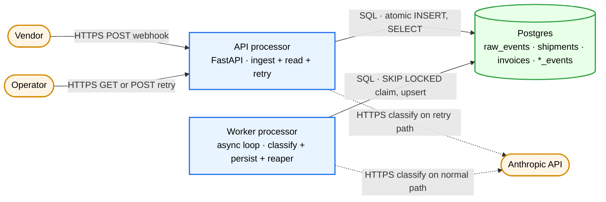
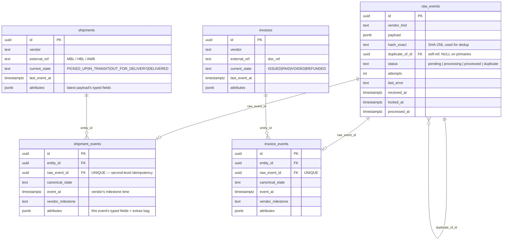
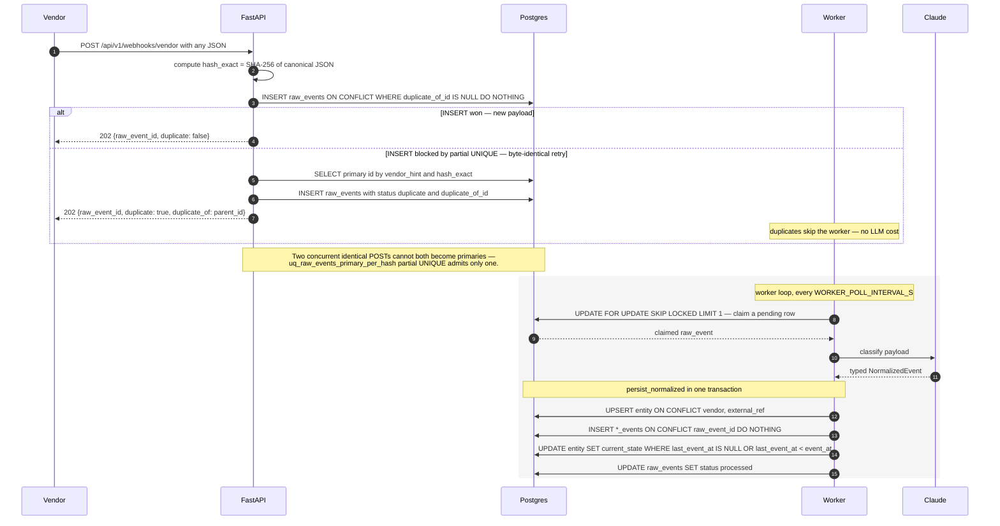
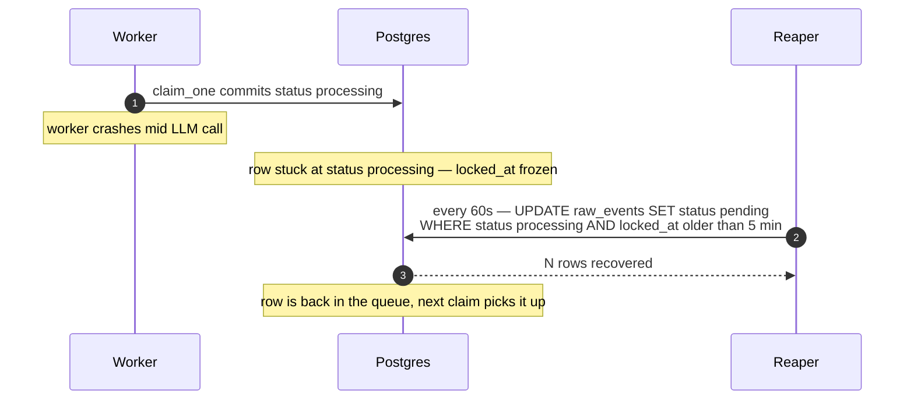
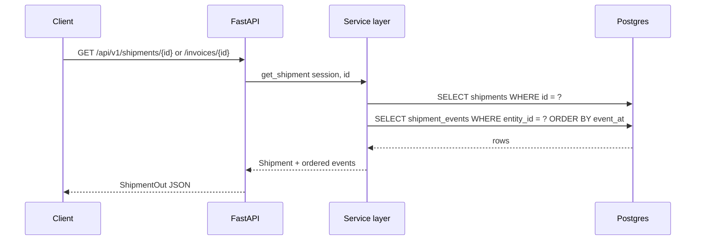
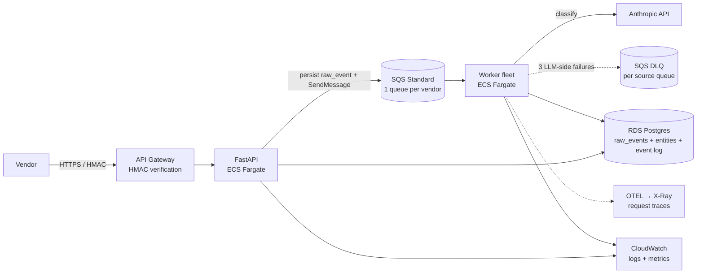

# Glacis — AI Webhook Ingestion Service

A backend that ingests vendor webhook payloads (any JSON shape), uses an LLM
to classify and normalize them into typed shipment / invoice events, and
persists them with full idempotency and out-of-order safety.

---

## 1. Components

Six boxes — what each one does and how they talk.

- **Vendor** — sends webhooks (any JSON shape) over HTTPS to the API.
- **Operator** — humans / internal services that read entities and trigger manual retries.
- **API processor** — FastAPI. Thin request path: hash + atomic INSERT to dedupe, return 202 in <100 ms. Also serves entity reads and the synchronous retry endpoint.
- **Worker processor** — asyncio loop. Claims pending rows from Postgres with `FOR UPDATE SKIP LOCKED`, calls Claude, persists the typed event in one transaction. A stale-claim reaper inside the same process recovers rows from worker crashes.
- **Anthropic API** — the LLM that classifies + normalizes the payload. Called by the worker on the normal path and by the API on the retry path.
- **Postgres** — the single shared dependency. All concurrency control (atomic claim, dedup, ordering guard) lives here as constraints + `SKIP LOCKED`, not as application-level locks.

---

## 2. Data model

Five tables. `raw_events` is the durable inbox; `shipments` / `invoices`
hold the latest state per entity; `*_events` keep the full audit history.
Entity tables are upserted on `(vendor, external_ref)` so all events about
the same shipment / invoice converge to one row.

**Three idempotency layers built into this model:**
1. `raw_events.hash_exact` — duplicate POSTs land as `status='duplicate'` with `duplicate_of_id` → parent (worker only claims `pending`, no LLM cost on duplicates).
2. `*_events.raw_event_id UNIQUE` — even if the worker re-processes the same row after a crash, only one normalized event ever exists.
3. `(vendor, external_ref)` upsert on entity tables — multiple events for the same logical shipment / invoice always converge to one row.

**Out-of-order ordering ("jump to latest, never roll back"):** the entity's
`current_state` is updated only when the incoming `event_at` is strictly
greater than `last_event_at`. A late `IN_TRANSIT` arriving after `DELIVERED`
lands in history but does NOT regress current state.

---

## 3. Flow

The split (api / worker / reaper) is the central design move: the request
path is one INSERT and returns 202 well under 100 ms even though LLM calls
take 1–3 s.

### 3a. Webhook ingest + asynchronous classification

### 3b. Crash recovery (stale-claim reaper)

### 3c. Read path

### API endpoints

| Method | Path | Purpose |
| --- | --- | --- |
| `POST` | `/api/v1/webhooks/{vendor}`              | Accept any JSON. Dedupes by content hash; returns `202 {raw_event_id, duplicate, duplicate_of}`. |
| `GET`  | `/api/v1/shipments/{id}`                 | Fetch a shipment with its full event history. |
| `GET`  | `/api/v1/invoices/{id}`                  | Fetch an invoice with its full event history. |
| `POST` | `/api/v1/raw-events/{id}/retry`          | **Operator-triggered retry.** Synchronously re-runs LLM classification + persistence for a single `raw_event_id`. Locks the row so the worker's `SKIP LOCKED` claim passes over it. `404` if id unknown, `409` if row is a duplicate or already processed, `502` if the LLM call fails (row reset to `pending` for a future retry), `200` with `{status, attempts, canonical_state, entity_type, last_error}` on success. |
| `GET`  | `/healthz`                               | Liveness + DB reachability. |

The OpenAPI spec is exposed at `/docs` (Swagger UI) and `/openapi.json`.

---

## 4. Decisions

The architectural choices, in order of how much they shape the rest of the
system. Tech-stack picks come last — they're the easiest to swap.

### Split the request path from the LLM path
The single most consequential decision. Vendors expect sub-second ack; LLM
calls take 1–3 s. Putting the LLM in the request path violates the SLA on
every webhook. Splitting them lets the API endpoint stay at one INSERT
returning `202`, while the worker absorbs latency, retries, and crashes
asynchronously. The cost: an extra durable queue (Postgres-as-queue here).
Worth it — the alternative is HTTP timeouts back to the vendor.

### Hash-based dedup, not vendor-id-based
Vendors put event identifiers in different fields (`event_msg_id`,
`event_id`, `advisory_id`, none-at-all), and some put **entity-level** IDs
(`doc_ref`) that are stable across events for the same entity. A
field-name whitelist would silently drop genuine new events as duplicates
the first time we hit a new vendor. SHA-256 of the canonical-form
payload is vendor-agnostic, content-defined, and catches the dominant
real-world case (HTTP retry libraries — Stripe, AWS SDK, requests, fetch
— re-send byte-identical bodies on timeout/5xx). It misses semantic
duplicates that differ in a single timestamp; we accept that as a
known-acceptable miss rather than ship a fragile field-guesser.

### "Jump to latest, never roll back" for entity state
Out-of-order arrival is normal: vendors retry, networks reorder, batches
flush late. Two policies were on the table:

  - Wait for events to arrive in canonical order (block out-of-order events).
  - Always use the event with the highest `event_at` for `current_state`,
    keep history of all events.

We took the second. Reason: a delayed `IN_TRANSIT` retry arriving after we
already learned `DELIVERED` should NOT undo the delivered fact. The audit
log keeps the late event so nothing is lost. Implementation is a
conditional `UPDATE ... WHERE last_event_at IS NULL OR last_event_at <
$event_at` in the same transaction as the event insert — race-free.

### Three tables per entity (raw / entity / events), not one
A flat `raw_events` table with a `normalized_state` JSONB column would
fit the same data, but loses two things: (a) the entity row as a
materialized view of latest state — `SELECT * FROM shipments WHERE
current_state = 'IN_TRANSIT'` becomes an index scan, not a JSONB search
across a wide log; (b) the clean audit boundary between "what the vendor
sent" (raw_events) and "what we've decided" (entities + events). The
3-table cost is two foreign keys and a tiny upsert — cheap.

`entity.attributes` is a **denormalized projection** of the latest event's
payload — overwritten on each newer event, NOT an aggregate. The event
log is the source of truth; the entity row is a cache of "what's true
right now". A replay walks events in `event_at` order and overwrites
`entity.attributes` with the highest-event's payload — exactly what
`persist_normalized` does live, just batched.

### Typed event union, not bag-of-attributes
Earlier prototype had `attributes: dict[str, Any]` — schema-free, the
LLM could put anything there, and consumers had to defensively re-parse.
The current `NormalizedEvent` has an envelope around a discriminated
union of 9 per-state payload classes. Each variant declares its
**mandatory** fields (what the platform needs to act on the event) and
**optional** ones (useful context to keep). Missing mandatory fields
surface as a Pydantic ValidationError naming the exact field, which the
worker parks in the DLQ — the operator sees what the LLM dropped.

The `extras: dict` per payload is the lossless escape hatch — vendor
fields we don't model land there verbatim so they're queryable later
without re-parsing the raw payload.

### Tech choices (last because they're swappable)
- **Python + FastAPI + SQLAlchemy 2 + Pydantic** — a 3-hour build benefits more from the data/LLM ecosystem maturity than from raw performance gains we don't need yet.
- **LangChain** — `with_structured_output(NormalizedEvent)` does the provider-agnostic JSON schema → tool-call wiring. Switching providers is a one-line change in `app/llm/__init__.py`.
- **Anthropic Claude (Sonnet 4.5 default)** — its tool-use schema honors JSON Schema `oneOf` + per-variant `required` fields faithfully, which is the contract our typed `NormalizedEvent` discriminated union depends on. We tried Gemini first (cheaper per token) but its `responseSchema` drops per-variant required fields on union schemas — Claude was the right call once strict-schema enforcement mattered. Default to Haiku for the cheap path; bump `LLM_MODEL` to a Sonnet/Opus id when accuracy needs more headroom.
- **Postgres-as-queue** — zero extra infra for the prototype; demonstrates the correct concurrency primitives. Replaced by SQS + DLQ in production (§4).

---

## 5. Proposed production architecture

