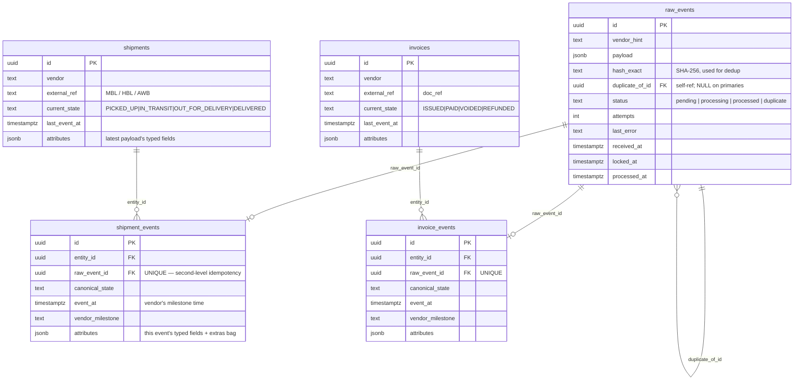
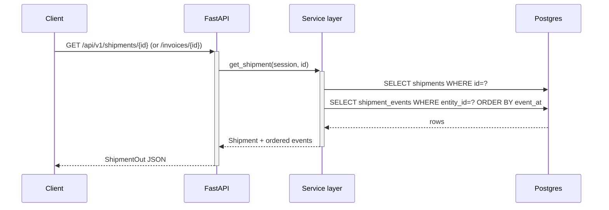
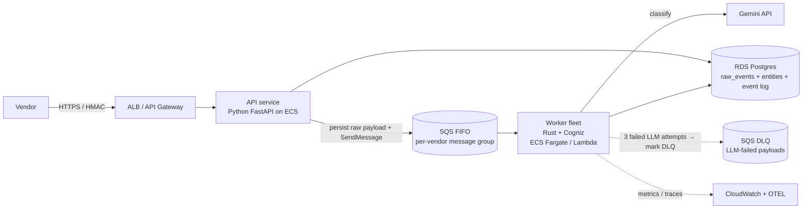

# Glacis — AI Webhook Ingestion Service

A backend that ingests vendor webhook payloads (any JSON shape), uses an LLM
to classify and normalize them into typed shipment / invoice events, and
persists them with full idempotency and out-of-order safety.

---

## 1. Data model

Five tables. `raw_events` is the durable inbox; `shipments` / `invoices`
hold the latest state per entity; `*_events` keep the full audit history.
Entity tables are upserted on `(vendor, external_ref)` so all events about
the same shipment / invoice converge to one row.



**Three idempotency layers built into this model:**
1. `raw_events.hash_exact` — duplicate POSTs land as `status='duplicate'` with `duplicate_of_id` → parent (worker only claims `pending`, no LLM cost on duplicates).
2. `*_events.raw_event_id UNIQUE` — even if the worker re-processes the same row after a crash, only one normalized event ever exists.
3. `(vendor, external_ref)` upsert on entity tables — multiple events for the same logical shipment / invoice always converge to one row.

**Out-of-order ordering ("jump to latest, never roll back"):** the entity's
`current_state` is updated only when the incoming `event_at` is strictly
greater than `last_event_at`. A late `IN_TRANSIT` arriving after `DELIVERED`
lands in history but does NOT regress current state.

---

## 2. Flow

The split (api / worker / reaper) is the central design move: the request
path is one INSERT and returns 202 well under 100 ms even though LLM calls
take 1–3 s.

### 2a. Webhook ingest + asynchronous classification

```mermaid
sequenceDiagram
    autonumber
    participant V as Vendor
    participant API as FastAPI
    participant DB as Postgres
    participant W as Worker (async loop)
    participant LLM as Gemini (LangChain)

    V->>+API: POST /api/v1/webhooks/{vendor} (any JSON)
    API->>API: compute hash_exact = SHA-256(canonical_json(payload))
    API->>DB: SELECT id FROM raw_events WHERE vendor_hint=? AND hash_exact=?

    alt no parent (new payload)
        API->>DB: INSERT raw_events (status='pending')
        API-->>V: 202 {raw_event_id, duplicate: false}
    else parent found (byte-identical retry)
        API->>DB: INSERT raw_events (status='duplicate', duplicate_of_id=parent)
        API-->>-V: 202 {raw_event_id, duplicate: true, duplicate_of: parent_id}
        Note over W: duplicates skip the worker → no LLM cost
    end

    rect rgb(245, 245, 245)
        Note over W: worker loop, every WORKER_POLL_INTERVAL_S
        W->>+DB: UPDATE ... FOR UPDATE SKIP LOCKED LIMIT 1<br/>(claim one 'pending' row)
        DB-->>W: claimed raw_event
        W->>+LLM: classify(payload)
        LLM-->>-W: typed NormalizedEvent (envelope + per-state payload)

        Note over W,DB: persist_normalized — single transaction
        W->>DB: BEGIN
        W->>DB: UPSERT entity ON CONFLICT (vendor, external_ref)
        W->>DB: INSERT *_events ON CONFLICT (raw_event_id) DO NOTHING
        W->>DB: UPDATE entity SET current_state=…<br/>WHERE last_event_at IS NULL OR last_event_at < event_at
        W->>DB: UPDATE raw_events SET status='processed'
        W->>-DB: COMMIT
    end
```

### 2b. Crash recovery (stale-claim reaper)

```mermaid
sequenceDiagram
    autonumber
    participant W as Worker
    participant DB as Postgres
    participant R as Reaper (in-process, every 60s)

    W->>DB: claim_one() commits status='processing'
    Note over W: worker crashes mid-LLM-call
    W--xDB: process dies; row stuck at status='processing'

    R->>DB: UPDATE raw_events SET status='pending'<br/>WHERE status='processing' AND locked_at < now() - 5min
    DB-->>R: N rows recovered
    Note over DB: row is back in the queue; next claim picks it up
```

### 2c. Read path



### API endpoints

| Method | Path | Purpose |
| --- | --- | --- |
| `POST` | `/api/v1/webhooks/{vendor}` | Accept any JSON. Dedupes by content hash; returns `202 {raw_event_id, duplicate, duplicate_of}`. |
| `GET`  | `/api/v1/shipments/{id}`     | Fetch a shipment with its full event history. |
| `GET`  | `/api/v1/invoices/{id}`      | Fetch an invoice with its full event history. |
| `GET`  | `/healthz`                   | Liveness + DB reachability. |

The OpenAPI spec is exposed at `/docs` (Swagger UI) and `/openapi.json`.

---

## 3. Decisions

The "why" behind each major choice, with the trade-offs I weighed.

### Language: Python (over the alternative TypeScript)
The role brief listed Python or JavaScript. I picked Python for two
reasons: the data / LLM ecosystem is wider and more mature (Pydantic,
SQLAlchemy 2 async, LangChain), and structured-output handling on the LLM
side is simpler to reason about. JavaScript would have worked but I'd be
fighting more of the boilerplate.

A personal aside: for a real production system at this layer I'd reach
for **Rust** — millisecond-tier latency on the worker, deterministic
memory, and zero runtime surprises around the DB connection pool. I've
been writing **Cogniz**, a Rust LLM library that plays the same role as
LangChain (provider-agnostic chat models, structured output, agentic
patterns), specifically because I want this option in production. For
this 3-hour scope Python pulls ahead on raw delivery speed — batteries
included, less code to read, and the win from Rust here is mostly about
scale we don't need yet.

### LLM orchestration: LangChain
- Provider-agnostic structured output (`with_structured_output(NormalizedEvent)`) — swapping Gemini for Anthropic / OpenAI is a one-line change.
- Agentic / sub-agent patterns ready out of the box if we later need to chain (e.g. tool-call back to a vendor lookup).
- Cuts the boilerplate for retry, prompt caching, and tool conversion.

### Model: Google Gemini 2.5 Flash
- Better at strict JSON / YAML output than Claude or OpenAI at comparable cost — important when the entire contract with the LLM is a typed schema.
- Cheaper per token, so retrying a flaky payload is affordable.
- Caveat: Gemini's structured output enforces `enum` but not `const` (Pydantic emits `const` for single-value `Literal`s, which is what discriminator fields generate). Mitigation: a one-line reminder in the prompt listing the allowed `canonical_state` values verbatim.

### Queue: Postgres `FOR UPDATE SKIP LOCKED` (over Redis / Kafka / SQS)
- Zero extra infrastructure — one container in `docker-compose.yml`.
- Demonstrates correct concurrency primitives (atomic claim, exactly-once-within-transaction semantics).
- Stale-claim reaper handles worker-crash-mid-LLM-call without an external broker.
- Production: I'd switch to AWS SQS + DLQ — see §4.

### Strict typed event schema (the LLM contract)
- `NormalizedEvent` is an envelope (`vendor` / `event_at` / `confidence`) wrapping a typed `payload` that's a discriminated union of 9 per-state variants.
- Each variant declares its OWN required vs optional fields; missing required fields produce a Pydantic ValidationError naming the exact field, which the worker parks in the DLQ with the message attached.
- Every payload carries an `extras: dict[str, Any]` bag for vendor-specific fields we don't model — preserved verbatim so future analytics / downstream systems can read them without re-parsing the raw payload.

---

## 4. Proposed production solution

What I'd change to take this past prototype.



### Queue: AWS SQS + DLQ
The Postgres-as-queue pattern is a good demo but every production ingest
pipeline I've built uses a managed broker. Concretely:

- **SQS FIFO** with one `MessageGroupId` per vendor (or per shipment / invoice when extracted) so per-entity ordering is preserved while throughput scales horizontally across groups.
- **Visibility timeout** handles worker-crash recovery (the message becomes visible again automatically — no in-process reaper needed).
- **DLQ trigger is at the LLM-processing layer, not message-receive.** A worker can claim a message and have it succeed at the framework level (deserialized fine) yet fail downstream because the LLM call timed out, hit a rate limit, or returned an unparseable response. We retry that classify+persist work up to 3 times; only after the third LLM-side failure does the worker explicitly move the payload to the DLQ. This keeps the DLQ focused on "real" failures (bad payloads, prompt drift, vendor schema we can't classify) rather than transient infra noise.
- Native CloudWatch metrics on queue depth, age-of-oldest-message, DLQ count → wired straight into alerting.

### Compute: Rust workers (with Cogniz)
- The throughput needle moves on the **worker** side, not the API. Latency-sensitive paths (poll → claim → LLM client → DB write) benefit from Rust's predictability and lower per-task memory.
- **Cogniz** (my Rust LLM library — provider abstraction, structured output, agentic patterns) plays the same role here that LangChain plays in the prototype.
- The API layer can stay in Python (FastAPI is fine for 100ms/req) — the interesting performance work is in the worker fleet.

### Storage: RDS Postgres only
- Entity store + raw payloads stay on Postgres (RDS) — same model as today, no separate object store.
- The `raw_events` table already holds the verbatim payload as JSONB, which means **prompt / model upgrades can be replayed** straight from the DB into a shadow set of entities for diff before promotion. Adding S3 would be premature; revisit only if raw-payload retention starts dominating storage cost.

### Other production wiring
- **HMAC verification** at the edge (per-vendor secret rotation via Secrets Manager).
- **OpenTelemetry** end-to-end: trace from POST → SQS receive → LLM call → DB write. Metrics on classification confidence, dedupe rate, DLQ depth, p99 ingest latency.
- **Per-vendor schema fast paths**: once a (vendor, shape) classification has been stable for N events, freeze it as a deterministic parser. LLM stays as the fallback for the long tail. Dramatically lowers token cost.
- **Multi-key entity correlation**: a small `(vendor, alias, entity_id)` mapping table so the same logical shipment can be referenced by master BL early, house BL later, container number in some events — a real-world freight-forwarder pain point.
