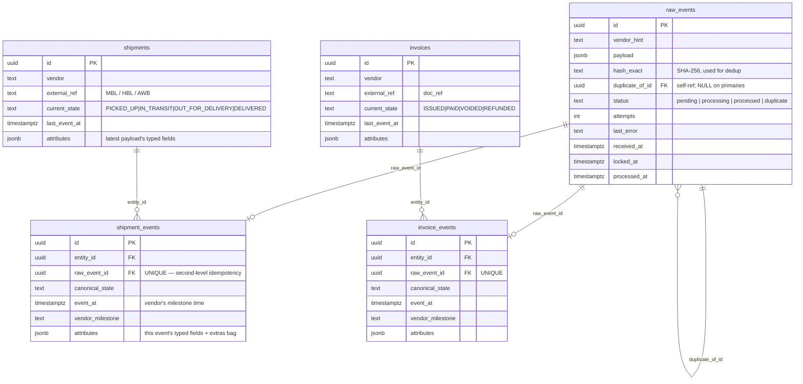
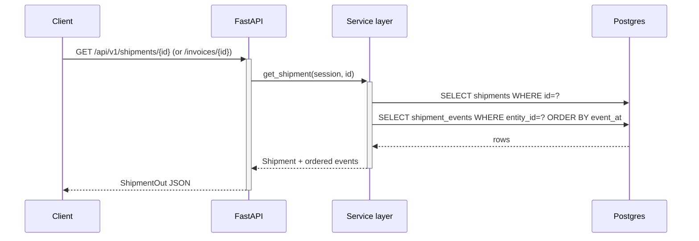
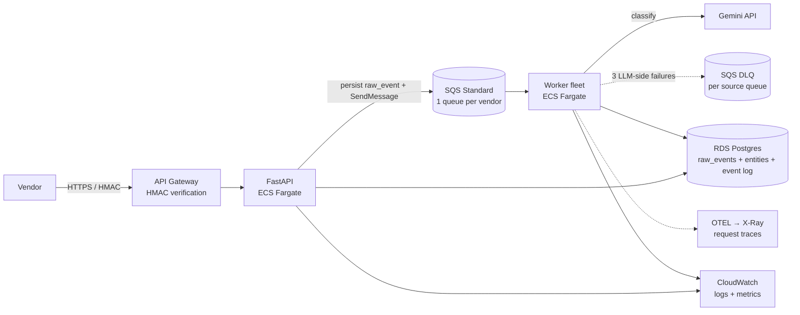

# Glacis — AI Webhook Ingestion Service

A backend that ingests vendor webhook payloads (any JSON shape), uses an LLM
to classify and normalize them into typed shipment / invoice events, and
persists them with full idempotency and out-of-order safety.

---

## 1. Components

Six boxes — what each one does and how they talk.

```mermaid
flowchart LR
    classDef ext fill:#fff5e6,stroke:#d68900,stroke-width:2px,color:#000
    classDef proc fill:#e8f4ff,stroke:#1f6feb,stroke-width:2px,color:#000
    classDef store fill:#e8ffe8,stroke:#2da043,stroke-width:2px,color:#000

    V([Vendor]):::ext
    OP([Operator]):::ext
    GEM([Gemini API]):::ext

    API[API processor<br/>FastAPI · ingest + read + retry]:::proc
    W[Worker processor<br/>async loop · classify + persist + reaper]:::proc

    DB[(Postgres<br/>raw_events · shipments · invoices · *_events)]:::store

    V   -->|HTTPS POST webhook| API
    OP  -->|HTTPS GET / POST retry| API
    API -->|SQL · atomic INSERT, SELECT| DB
    API -.->|HTTPS classify (retry path)| GEM

    W   -->|SQL · SKIP LOCKED claim, upsert| DB
    W   -.->|HTTPS classify (normal path)| GEM
```

- **Vendor** — sends webhooks (any JSON shape) over HTTPS to the API.
- **Operator** — humans / internal services that read entities and trigger manual retries.
- **API processor** — FastAPI. Thin request path: hash + atomic INSERT to dedupe, return 202 in <100 ms. Also serves entity reads and the synchronous retry endpoint.
- **Worker processor** — asyncio loop. Claims pending rows from Postgres with `FOR UPDATE SKIP LOCKED`, calls Gemini, persists the typed event in one transaction. A stale-claim reaper inside the same process recovers rows from worker crashes.
- **Gemini API** — the LLM that classifies + normalizes the payload. Called by the worker on the normal path and by the API on the retry path.
- **Postgres** — the single shared dependency. All concurrency control (atomic claim, dedup, ordering guard) lives here as constraints + `SKIP LOCKED`, not as application-level locks.

---

## 2. Data model

Five tables. `raw_events` is the durable inbox; `shipments` / `invoices`
hold the latest state per entity; `*_events` keep the full audit history.
Entity tables are upserted on `(vendor, external_ref)` so all events about
the same shipment / invoice converge to one row.



**Three idempotency layers built into this model:**
1. `raw_events.hash_exact` — duplicate POSTs land as `status='duplicate'` with `duplicate_of_id` → parent (worker only claims `pending`, no LLM cost on duplicates).
2. `*_events.raw_event_id UNIQUE` — even if the worker re-processes the same row after a crash, only one normalized event ever exists.
3. `(vendor, external_ref)` upsert on entity tables — multiple events for the same logical shipment / invoice always converge to one row.

**Out-of-order ordering ("jump to latest, never roll back"):** the entity's
`current_state` is updated only when the incoming `event_at` is strictly
greater than `last_event_at`. A late `IN_TRANSIT` arriving after `DELIVERED`
lands in history but does NOT regress current state.

---

## 3. Flow

The split (api / worker / reaper) is the central design move: the request
path is one INSERT and returns 202 well under 100 ms even though LLM calls
take 1–3 s.

### 3a. Webhook ingest + asynchronous classification

```mermaid
sequenceDiagram
    autonumber
    participant V as Vendor
    participant API as FastAPI
    participant DB as Postgres
    participant W as Worker (async loop)
    participant LLM as Gemini (LangChain)

    V->>+API: POST /api/v1/webhooks/{vendor} (any JSON)
    API->>API: compute hash_exact = SHA-256(canonical_json(payload))
    API->>DB: INSERT raw_events (duplicate_of_id=NULL)<br/>ON CONFLICT (vendor_hint, hash_exact)<br/>WHERE duplicate_of_id IS NULL DO NOTHING<br/>RETURNING id

    alt new payload — INSERT won (RETURNING id)
        API-->>V: 202 {raw_event_id, duplicate: false}
    else byte-identical retry — partial unique index blocked the INSERT
        API->>DB: SELECT primary id WHERE vendor_hint=? AND hash_exact=?
        API->>DB: INSERT raw_events (status='duplicate', duplicate_of_id=parent)
        API-->>-V: 202 {raw_event_id, duplicate: true, duplicate_of: parent_id}
        Note over W: duplicates skip the worker → no LLM cost
    end

    Note over API,DB: The INSERT-then-conflict path is the atomic backstop:<br/>two concurrent identical POSTs cannot both become primaries because<br/>uq_raw_events_primary_per_hash (partial UNIQUE) admits only one.

    rect rgb(245, 245, 245)
        Note over W: worker loop, every WORKER_POLL_INTERVAL_S
        W->>+DB: UPDATE ... FOR UPDATE SKIP LOCKED LIMIT 1<br/>(claim one 'pending' row)
        DB-->>W: claimed raw_event
        W->>+LLM: classify(payload)
        LLM-->>-W: typed NormalizedEvent (envelope + per-state payload)

        Note over W,DB: persist_normalized — single transaction
        W->>DB: BEGIN
        W->>DB: UPSERT entity ON CONFLICT (vendor, external_ref)
        W->>DB: INSERT *_events ON CONFLICT (raw_event_id) DO NOTHING
        W->>DB: UPDATE entity SET current_state=…<br/>WHERE last_event_at IS NULL OR last_event_at < event_at
        W->>DB: UPDATE raw_events SET status='processed'
        W->>-DB: COMMIT
    end
```

### 3b. Crash recovery (stale-claim reaper)

```mermaid
sequenceDiagram
    autonumber
    participant W as Worker
    participant DB as Postgres
    participant R as Reaper (in-process, every 60s)

    W->>DB: claim_one() commits status='processing'
    Note over W: worker crashes mid-LLM-call
    W--xDB: process dies; row stuck at status='processing'

    R->>DB: UPDATE raw_events SET status='pending'<br/>WHERE status='processing' AND locked_at < now() - 5min
    DB-->>R: N rows recovered
    Note over DB: row is back in the queue; next claim picks it up
```

### 3c. Read path



### API endpoints

| Method | Path | Purpose |
| --- | --- | --- |
| `POST` | `/api/v1/webhooks/{vendor}`              | Accept any JSON. Dedupes by content hash; returns `202 {raw_event_id, duplicate, duplicate_of}`. |
| `GET`  | `/api/v1/shipments/{id}`                 | Fetch a shipment with its full event history. |
| `GET`  | `/api/v1/invoices/{id}`                  | Fetch an invoice with its full event history. |
| `POST` | `/api/v1/raw-events/{id}/retry`          | **Operator-triggered retry.** Synchronously re-runs LLM classification + persistence for a single `raw_event_id`. Locks the row so the worker's `SKIP LOCKED` claim passes over it. `404` if id unknown, `409` if row is a duplicate or already processed, `502` if the LLM call fails (row reset to `pending` for a future retry), `200` with `{status, attempts, canonical_state, entity_type, last_error}` on success. |
| `GET`  | `/healthz`                               | Liveness + DB reachability. |

The OpenAPI spec is exposed at `/docs` (Swagger UI) and `/openapi.json`.

---

## 4. Decisions

The architectural choices, in order of how much they shape the rest of the
system. Tech-stack picks come last — they're the easiest to swap.

### Split the request path from the LLM path
The single most consequential decision. Vendors expect sub-second ack; LLM
calls take 1–3 s. Putting the LLM in the request path violates the SLA on
every webhook. Splitting them lets the API endpoint stay at one INSERT
returning `202`, while the worker absorbs latency, retries, and crashes
asynchronously. The cost: an extra durable queue (Postgres-as-queue here).
Worth it — the alternative is HTTP timeouts back to the vendor.

### Hash-based dedup, not vendor-id-based
Vendors put event identifiers in different fields (`event_msg_id`,
`event_id`, `advisory_id`, none-at-all), and some put **entity-level** IDs
(`doc_ref`) that are stable across events for the same entity. A
field-name whitelist would silently drop genuine new events as duplicates
the first time we hit a new vendor. SHA-256 of the canonical-form
payload is vendor-agnostic, content-defined, and catches the dominant
real-world case (HTTP retry libraries — Stripe, AWS SDK, requests, fetch
— re-send byte-identical bodies on timeout/5xx). It misses semantic
duplicates that differ in a single timestamp; we accept that as a
known-acceptable miss rather than ship a fragile field-guesser.

The TOCTOU race that "SELECT-then-INSERT" would create is closed by a
**partial UNIQUE index** on `(vendor_hint, hash_exact) WHERE
duplicate_of_id IS NULL` — see `alembic/versions/0003`. Two concurrent
identical POSTs cannot both become primaries.

### Three idempotency layers, not one
Each layer catches a failure mode the others can't:

| Layer | Failure it catches |
| --- | --- |
| `raw_events.hash_exact` partial UNIQUE | Vendor's HTTP layer retries the same body |
| `*_events.raw_event_id UNIQUE` | Worker crashes mid-transaction; reaper hands the row back; second worker re-classifies — same content lands again |
| `(vendor, external_ref)` upsert on entity tables | LLM returns the right entity ref but a different attribute snapshot — they still converge to one row |

Single-layer designs (just hash, just entity uniqueness) all fail under at
least one of these. Three layers is the minimum that covers the matrix.

### "Jump to latest, never roll back" for entity state
Out-of-order arrival is normal: vendors retry, networks reorder, batches
flush late. Two policies were on the table:

  - Wait for events to arrive in canonical order (block out-of-order events).
  - Always use the event with the highest `event_at` for `current_state`,
    keep history of all events.

We took the second. Reason: a delayed `IN_TRANSIT` retry arriving after we
already learned `DELIVERED` should NOT undo the delivered fact. The audit
log keeps the late event so nothing is lost. Implementation is a
conditional `UPDATE ... WHERE last_event_at IS NULL OR last_event_at <
$event_at` in the same transaction as the event insert — race-free.

### Three tables per entity (raw / entity / events), not one
A flat `raw_events` table with a `normalized_state` JSONB column would
fit the same data, but loses two things: (a) the entity row as a
materialized view of latest state — `SELECT * FROM shipments WHERE
current_state = 'IN_TRANSIT'` becomes an index scan, not a JSONB search
across a wide log; (b) the clean audit boundary between "what the vendor
sent" (raw_events) and "what we've decided" (entities + events). The
3-table cost is two foreign keys and a tiny upsert — cheap.

`entity.attributes` is a **denormalized projection** of the latest event's
payload — overwritten on each newer event, NOT an aggregate. The event
log is the source of truth; the entity row is a cache of "what's true
right now". A replay walks events in `event_at` order and overwrites
`entity.attributes` with the highest-event's payload — exactly what
`persist_normalized` does live, just batched.

### Typed event union, not bag-of-attributes
Earlier prototype had `attributes: dict[str, Any]` — schema-free, the
LLM could put anything there, and consumers had to defensively re-parse.
The current `NormalizedEvent` has an envelope around a discriminated
union of 9 per-state payload classes. Each variant declares its
**mandatory** fields (what the platform needs to act on the event) and
**optional** ones (useful context to keep). Missing mandatory fields
surface as a Pydantic ValidationError naming the exact field, which the
worker parks in the DLQ — the operator sees what the LLM dropped.

The `extras: dict` per payload is the lossless escape hatch — vendor
fields we don't model land there verbatim so they're queryable later
without re-parsing the raw payload.

### Tech choices (last because they're swappable)
- **Python + FastAPI + SQLAlchemy 2 + Pydantic** — a 3-hour build benefits more from the data/LLM ecosystem maturity than from raw performance gains we don't need yet.
- **LangChain** — `with_structured_output(NormalizedEvent)` does the provider-agnostic JSON schema → tool-call wiring. Switching providers is a one-line change in `app/llm/__init__.py`.
- **Google Gemini 2.5 Flash** — better at strict JSON/Decimal output than Claude or OpenAI at comparable cost, and much cheaper per token so retrying flaky payloads is affordable. Caveat: Gemini's structured output enforces JSON Schema `enum` but not `const`, and `const` is what Pydantic emits for single-value `Literal`s. Mitigation: the prompt explicitly lists the allowed `canonical_state` values; the test suite snapshot-asserts those listings stay in the prompt.
- **Postgres-as-queue** — zero extra infra for the prototype; demonstrates the correct concurrency primitives. Replaced by SQS + DLQ in production (§4).

---

## 5. Proposed production architecture



### Edge: API Gateway, not ALB
Vendor webhooks need HMAC signature verification per vendor (with secret
rotation in Secrets Manager). API Gateway has first-class request-validation
and Lambda authorizers; ALB would push HMAC into the FastAPI app and
duplicate every team's wheel. Throughput cap (10k RPS per region without
a quota bump) is fine for a webhook ingest workload.

### Compute: ECS Fargate for both API and worker
Lambda is tempting for the API (cold starts irrelevant on warm traffic),
but the worker holds an LLM call open for ~1–3 s — Lambda billing on
sustained latency is worse than Fargate's per-vCPU-second pricing. Same
runtime for both keeps deployment simple.

### Queue: SQS Standard with one queue per vendor
- **One SQS queue per vendor** (not one queue with FIFO MessageGroupId-per-vendor). FIFO caps at 300 TPS per group, which doesn't scale per-shipment because we don't know the shipment id until after classification — chicken-and-egg. Per-vendor queues sidestep both problems: each vendor scales independently, and within-vendor ordering is best-effort (the entity-level "jump to latest" guard already handles ordering correctly, so per-message FIFO isn't required).
- **Visibility timeout** handles worker-crash recovery — no in-process reaper needed.
- **DLQ at the LLM layer, not the receive layer.** A message can deserialize fine but fail downstream because the LLM timed out, hit a rate limit, or returned an unparseable response. After 3 LLM-side failures the worker explicitly publishes to the DLQ. This keeps the DLQ focused on real failures (bad payloads, prompt drift, novel vendor schemas) rather than transient infra noise.
- DLQ visibility = `SELECT * FROM raw_events WHERE status = 'failed'` plus the SQS DLQ message body. No separate admin UI in v1; CloudWatch alarm on DLQ depth is the operator surface.

### Storage: RDS Postgres only
Entity store + raw payloads stay on Postgres (RDS) — same model as
today, no separate object store. The `raw_events` table already holds
the verbatim payload as JSONB so **prompt / model upgrades replay
straight from the DB** (see §6 schema-evolution story). Adding S3 would
be premature; revisit only if raw-payload retention starts dominating
storage cost.

### Observability: CloudWatch for metrics + logs, OTEL → X-Ray for traces
Two distinct stacks doing distinct things:
- **CloudWatch** — structured app logs (already JSON via `structlog`) and metrics (queue depth, p99 ingest latency, DLQ count, classification confidence histogram). Native to AWS, alarming included.
- **OpenTelemetry** spans the request lifecycle (POST → SQS receive → LLM call → DB write). Exported to X-Ray (or Honeycomb/Datadog if the org standardizes there). Diagnoses tail latency that aggregate metrics can't.

CloudWatch is operator-facing; OTEL is engineer-facing. Keeping them
separate avoids the trap of stuffing trace data into CloudWatch metrics
where the high cardinality blows up the bill.

### Other production wiring
- **Per-vendor schema fast paths**: once a (vendor, payload-shape) classification has been stable for N events, freeze it as a deterministic parser. LLM stays as the fallback for the long tail. Dramatically lowers token cost.
- **Multi-key entity correlation**: a small `(vendor, alias, entity_id)` mapping table so the same logical shipment can be referenced by master BL early, house BL later, container number in some events — a real-world freight-forwarder pain point.

---

## 6. Failure modes & DLQ semantics

Two distinct failure surfaces, with two distinct names:

| Status        | Meaning | Visible to claim queue? | Operator query |
| ---           | --- | :---: | --- |
| `pending`     | Queued, attempts may be 0..max-1 | yes | `WHERE status='pending'` (queue depth) |
| `processing` | A worker holds it; reaper will reset if `locked_at` falls behind. | no | (in-flight) |
| `processed`   | Done. | no | (done) |
| `duplicate`   | Byte-identical to an earlier `pending`/`processed` row. | no | `WHERE status='duplicate'` (audit) |
| `failed`      | **Terminal DLQ.** `attempts >= max_attempts` real LLM/persist failures. Operator must intervene (typically `POST /raw-events/{id}/retry` after fixing the prompt). | no | `WHERE status='failed'` |

The crucial split: `attempts` is incremented **only by `mark_failed`**
(real classify or persist failure), NOT by `claim_one`. A worker crash
between claim and persist costs zero retry budget — the reaper resets
the row to `pending` and the next claim is "free". This means the DLQ
budget actually counts LLM-side failures, not deploys-during-active-jobs.

Reaper window math: LLM client `timeout=30s × max_retries=2` ⇒ ~90s
worst-case LLM, plus ~1s persist ⇒ ~100s in-flight. Default
`worker_stale_lock_minutes=5` (300s) gives a 3× margin. **If you raise
the LLM timeout, raise the reaper window in lockstep** — they're a pair.

---

## 7. Schema evolution

The system is event-sourced: `raw_events` is the journal, `*_events` is
the typed event log, entity rows are projections. That makes most schema
changes safer than they look — but only if you choose the right tool.

| Change | What to do |
| --- | --- |
| Add an **optional** field to a payload variant | Just add it. JSONB readers tolerate the missing key on old rows; new events populate it from the LLM. No migration. |
| Add a **mandatory** field (was optional, becoming required) | Old rows can violate the new contract. Either: backfill via the replay flow below, then tighten the schema; or accept that historical rows won't validate (read-only) and check on write only. |
| Rename / split a field | Migration writes the new field from the old one in one tx; ship readers handling both for one release; drop the old field in the next. |
| **Reclassify under a new prompt** | The replay flow: walk `raw_events` ASC by `received_at`, re-run the classifier into a **shadow** entity/event set, diff vs production, promote when satisfied. The verbatim payloads are still in `raw_events.payload` — that's why we keep them. The retry endpoint is the one-event version of the same flow. |
| Bump the canonical-state vocabulary | Add the new state to `_PAYLOAD_BY_STATE` + a new payload variant; ship; then consider a backfill if you want historical rows reclassified. The `unclassified` bucket absorbs anything you don't reclassify. |

What's **not** there yet: an explicit `events.schema_version` column. For
the prototype, `_events.attributes` JSONB is permissive enough that
additive evolution works without one. A v1 production system would add
it the moment we ship a breaking change to a payload variant.
